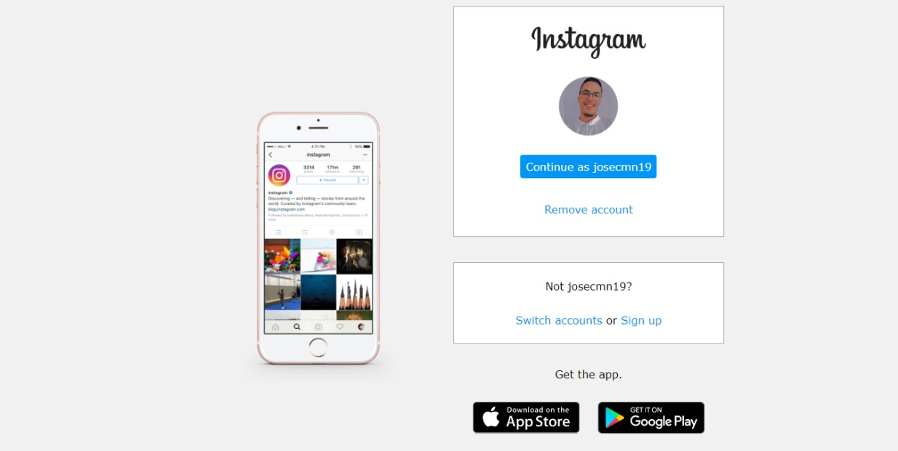

# Projeto Landing Page Instagram
Nesse projeto fui desafiado a reconstruir a página de login do Instagram. Para isso, foi usado CSS com Flexbox, uma das abordagens de posicionamento de elementos mais utilizadas quando se trata de responsividade. 

🔗 [Clique aqui para acessar o certificado](https://page-instagram-projects.web.app)

## Autor

<a href="https://www.linkedin.com/in/jose-nascimento1/">
 
  
 <b>José Nascimento</b></a> 
 
Feito por José Nascimento 👨‍💻.

